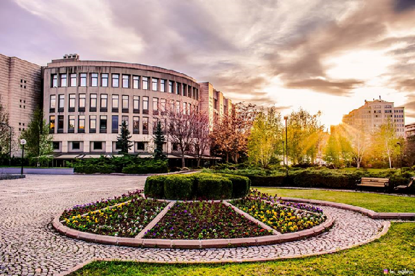
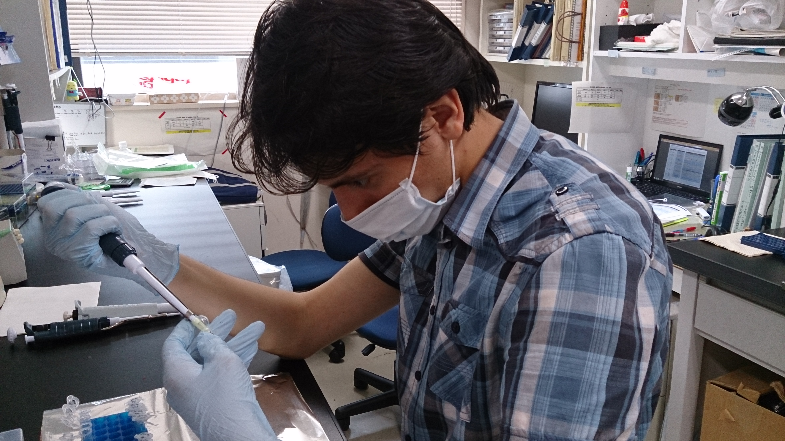
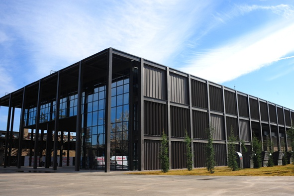

<!-- Main -->

<!-- One -->
<section id="one" class="background-accent3">
	

		<header class="major">
			<h2>My career journey</h2>
		</header>
		
 I am a Bioinformatics Scientist at the 
			<a href='http://kaplanlab.com/' > Kaplan Lab </a> in Abdullah Gül University, Turkey. Currently, I am looking for a PhD position in bioinformatics.
		

	

</section>

<!-- Two -->
<section id="two" class="spotlights">
	<section>
		
		

			

				<header class="major">
					<h3>BSc</h3>
				</header>
				
I started studying molecular biology and genetics in 2010 at Bilkent University (Ankara,Turkey), which is one of the top universities in Turkey. There, I did my thesis project on designing urea and uric acid logic circuits in <i>E. coli</i> in <a href='http://synbiolab.bilkent.edu.tr/' > Seker lab </a>.
				

			

		

	</section>
	<section>
		<a href="" class="image">
			
			<!---->
		</a>
		

			

				<header class="major">
					<h3>Internship</h3>
				</header>
				
In the summer of 2015, I traveled to Japan, which was my first time going abroad, to do my summer internship 
				in <a href='https://www.lif.kyoto-u.ac.jp/e/?post_type=labos&p=175' > Fujita lab </a>, in the beautiful city Kyoto, 
				where I worked on revealing biochemical properties of mouse MDA5 protein.
				

			

		

	</section>
	<section>
		
		

			

				<header class="major">
					<h3>MSc</h3>
				</header>
				
I obtained my MSc from Abdullah Gül University, where I worked in 
					<a href='http://kaplanlab.com/' > Kaplan Lab </a>. I defended my master's thesis on "Functional characterization of novel ciliary gene <i>TMEM145</i>" in 2020. During MSc studies, I have involved in a wide range of projects utilizing dry lab techniques such as machine learning and multi omics data analysis; as well as wet lab techniques like CRISPR/Cas9, molecular cloning and functional experiments on <i>C. elegans</i>.
				

			

		

	</section>
	<section>
		
		

			

				<header class="major">
					<h3>Bioinformatics scientist</h3>
				</header>
				
Since September 2020, I have been working in the group of 
					<a href='http://kaplanlab.com/' > Oktay Kaplan </a> 
					in the Abdullah Gül University as a bioinformatics scientist. In the mean time, I have been looking for a PhD position.
					If you are curious about my professional background, check out 
					<a href='assets/CV_MustafaSametPir.pdf' > my CV. </a> 
				

			

		

	</section>
</section>